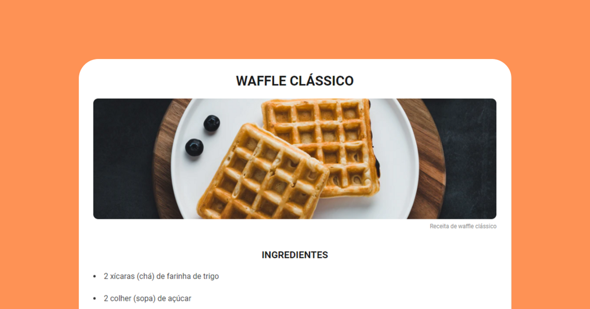

<h1 align="center">💻 Sobre o desafio</h1>

  

  Nesse desafio criei página web de uma receita com título, imagem, lista de ingredientes e modo de preparo estilizando com CSS.  

## 🚀 Tecnologias

Esse desafio foi desenvolvido com as seguintes tecnologias:

- HTML e CSS

---
desafio encontrasse nesse <a href="https://efficient-sloth-d85.notion.site/Desafio-Piloto-P-gina-de-Receita-15acc6a34f744484a2e64a1f115bfbae">link</a>
Feito com ♥ by Rocketseat
